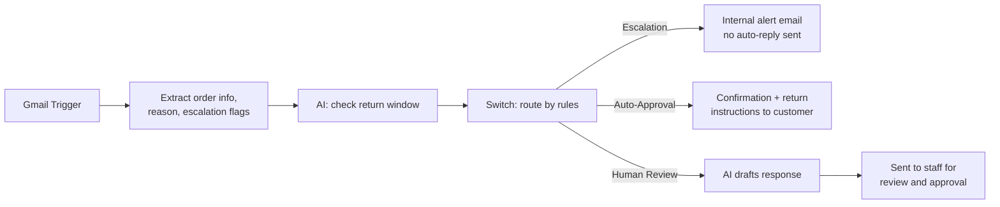
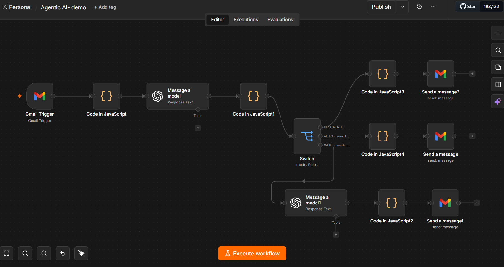

# AI-Powered Returns Management Automation using n8n

## Project Overview

This project demonstrates an agentic AI workflow built in n8n to automate the handling of customer return requests received through email. The solution combines workflow automation, business rules, and AI-generated responses to reduce manual effort while ensuring sensitive cases are escalated appropriately.

The workflow automatically reads incoming emails, extracts key information such as order numbers and return reasons, validates return eligibility against company policy, detects potential legal escalation language, and routes each request to the appropriate resolution path — improving response times and consistency while keeping a human in the loop for complex cases.

## Business Problem

Many businesses process return requests manually, requiring customer service teams to read every incoming email, identify order details, verify return eligibility, determine whether escalation is required, and draft customer responses. This process can be slow, inconsistent, and especially strained during high-volume periods.

This project automates the repetitive parts of that process, freeing staff to focus on exceptions and complex customer cases.

## Technologies Used

- n8n (workflow automation platform)
- Gmail integration
- JavaScript (Code nodes)
- OpenAI (GPT-4o)

## Workflow Architecture

**1. Email Monitoring**
A Gmail trigger continuously monitors the inbox and activates the workflow whenever a new return request email arrives, extracting the sender address, subject, body, and message ID.

**2. Intelligent Email Analysis**
A JavaScript node performs automated triage:
- Extracts order numbers using pattern matching
- Identifies return reasons (damaged, faulty, wrong item, etc.)
- Detects legal or escalation-related language
- Checks whether the order falls within the 30-day return policy

**3. AI-Powered Decision Support**
An LLM (GPT-4o) is used to generate human-like responses and explanations. AI is used only for communication and response generation — business decisions (eligibility, escalation) remain rule-based in code, not delegated to the model.

### Automated Decision Paths

The workflow routes each request into one of three paths:

| Path | Trigger | Action |
|------|---------|--------|
| **Escalation** | Legal/regulatory language detected (e.g. solicitor, trading standards, legal action) | Flags as high priority, sends an internal alert, suppresses any automated customer reply |
| **Auto-Approval** | Request is within the 30-day return window | Auto-approves the return, sends confirmation and return instructions directly to the customer |
| **Human Review** | Outside the 30-day window, no escalation indicators | AI drafts a suggested response, sent to staff for review and editing before sending |

## Workflow Diagram





## Outcomes and Benefits

- Faster response times
- Reduced manual processing effort
- Consistent customer communication
- Improved handling of policy exceptions
- Better visibility into return request workflows
- Enhanced customer service efficiency

By combining AI with explicit business rules, the workflow automates routine return requests while keeping sensitive or non-standard cases under human control.

## Project Structure

```
returns-automation-n8n/
├── workflow/
│   └── returns-automation.json
├── assets/
│   └── n8n-canvas-screenshot.png
├── .gitignore
└── README.md
```
